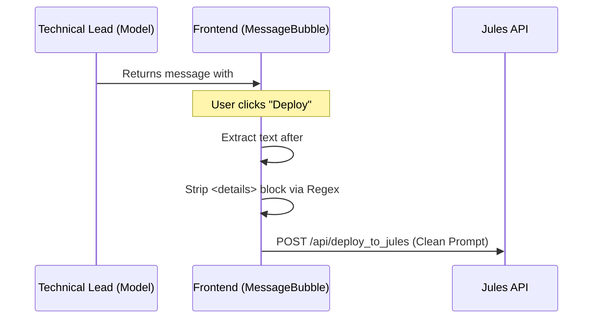

# ADR-002: Cleaning Reasoning Trace from Jules Prompts

## Status
Proposed

## Context
The system currently appends a reasoning trace and tool usage summary within a `
` block to the model's responses. This is intended to provide transparency to the human user.
However, when a user clicks the "Deploy" button to send a generated prompt to Jules (the Coding Agent), the entire content of the message—including the internal reasoning metadata—is sent. This results in:
1. Increased token consumption for Jules.
2. Potential confusion for Jules as it receives the Technical Lead's internal monologue.
3. Noise in the task instructions.

## Decision
We will implement a cleaning step in the frontend application where the Jules prompt is prepared. Specifically, in `frontend/src/components/MessageBubble.tsx`, the `deploy` function will be updated to:
1. Locate the `## Jules Prompt` marker.
2. Extract the subsequent text.
3. Use a regular expression to remove any `
` tags and their inner content.
4. Trim any resulting whitespace.

This ensures that the "reasoning and tool usage" block is stripped before the prompt reaches the Jules API.

## Alternatives Considered
- **Backend Stripping:** Modify `app/routers/jules.py` to strip the content. While robust, the frontend already performs extraction and cleaning of the prompt (e.g., removing markdown fences), so it's consistent to handle it there.
- **Separate Storage:** Store reasoning trace in a separate database column. This would require a database migration and a more significant refactor of the message system. Given the current requirements, frontend stripping is more efficient.

## Consequences
- **Positive:** Jules receives cleaner, more focused instructions.
- **Positive:** No database migrations or backend schema changes required.
- **Negative:** If the reasoning trace is placed *above* the `## Jules Prompt` marker, the current frontend logic might miss it, but the Technical Lead is programmed to place it at the end.
- **Neutral:** The human user still sees the reasoning trace in the UI.

## Diagram

