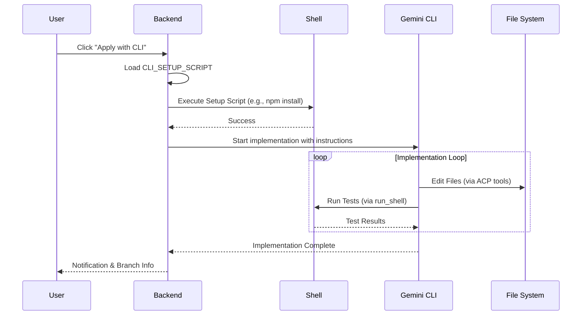

# Architecture: CLI Engine "Active-Workspace" Mode

## Context
We want to allow the CLI Engine (Gemini) to autonomously implement features by editing files and running commands. This requires an environment that is correctly set up with necessary frameworks and dependencies.

## Design Decisions

### 1. Workspace Provisioning (Setup Script)
To ensure the environment is ready for the agent (e.g., specific testing frameworks, linting tools), the user can provide a "Setup Script".
- **Location:** Configurable via settings (`CLI_SETUP_SCRIPT`) or a default `.jules/setup.sh`.
- **Execution:** Runs synchronously before the `CLILLMService` begins the implementation phase.
- **Scope:** Runs in the current working directory.

### 2. Autonomous Implementation Loop
The `CLILLMService` will operate in a loop:
1. **Initialize:** Load system prompt and run Setup Script.
2. **Think & Act:** The LLM generates a plan and calls tools (write, patch, shell).
3. **Verify:** The LLM calls a shell command (e.g., `npm test`) to verify the fix.
4. **Iterate:** If tests fail, the LLM receives the output and tries again.

### 3. Alternative UI Flow
Instead of only "Dispatch to Jules", the UI will offer "Apply with CLI" if `CLI_EDIT_ENABLED` is true.

## Sequence Diagram

