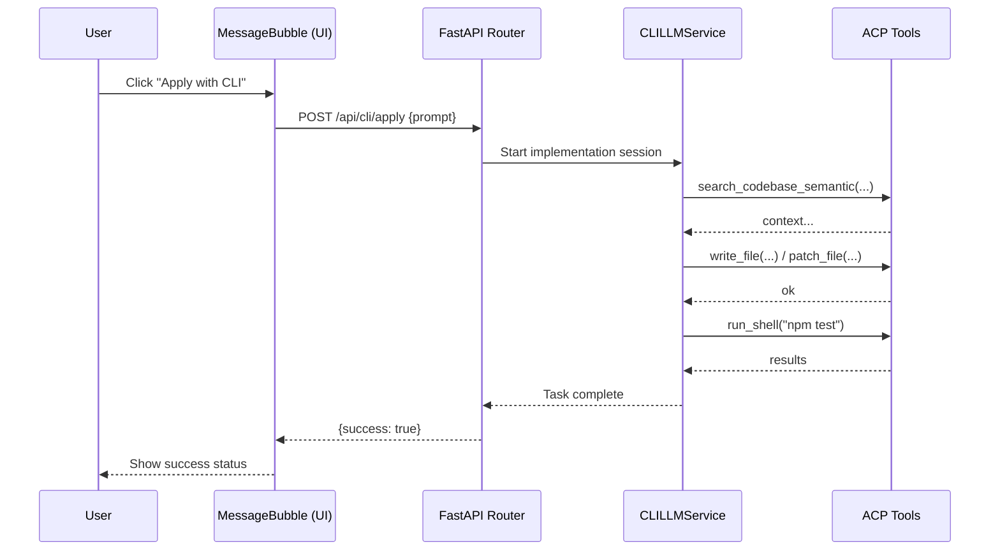

# Architecture: CLI Engine Active Edit Alternative

## Context
Currently, the system generates a "Jules Prompt" which the user can manually copy or "Deploy" to an external agent (Jules). We want to provide an alternative where the local CLI Engine (powered by Gemini) can autonomously implement the changes described in the prompt.

## Design
1. **Setting**: A new toggle `cli_edit_enabled` will be added to the system settings.
2. **UI Component**: The `MessageBubble` component will be updated to display an "Apply with CLI" button if the setting is active and a Jules Prompt is detected.
3. **Execution Flow**:
    - User clicks "Apply with CLI".
    - Frontend sends the prompt content to `POST /api/cli/apply`.
    - Backend starts a `CLILLMService` session in "Active-Workspace" mode.
    - The CLI Engine uses its toolset (LSP, Git, File Ops) to implement the requested feature.

## Technical Details

### 1. Settings Update
- **`app/config.py`**: Add default `CLI_EDIT_ENABLED = False`.
- **`app/routers/system.py`**: Update `SettingsRequest` and API handlers.

### 2. Frontend Changes
- **`frontend/src/App.tsx`**: Fetch and manage the `cliEditEnabled` state.
- **`frontend/src/components/MessageBubble.tsx`**: 
    - Receive `cliEditEnabled` as a prop.
    - Render the "Apply with CLI" button.
    - Implement the `applyWithCli` handler.

### 3. Backend Execution (`app/routers/chat.py`)
- New endpoint `POST /api/cli/apply`:
    - Receives the prompt.
    - Uses `CLILLMService` with a high-temperature, implementation-focused system prompt.
    - Monitors progress and returns success/failure.

## Sequence Diagram

