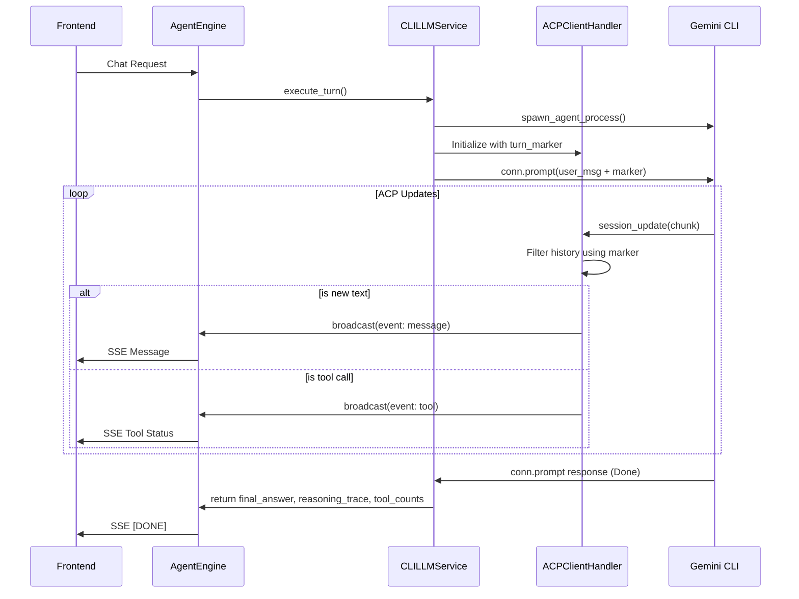

# ADR: Improving CLI Engine Streaming and ACP Integration

## Status
Proposed

## Context
The current `CLILLMService` (CLI Engine) implementation for Gemini has several issues:
1. **No Output**: Users report receiving no output during streaming. This is likely due to the `ACPClientHandler` being too restrictive or failing to find the `turn_marker`.
2. **Missing Progress**: Unlike the `SDKLLMService`, the CLI engine does not broadcast tool usage or reasoning (thoughts) to the frontend.
3. **History Re-emission**: The Gemini CLI re-emits session history when resuming a session, which must be filtered to prevent duplicate output in the UI.
4. **Data Format Incompatibility**: The `ACPClientHandler` expects strictly typed `TextContentBlock` objects, but the ACP SDK may deliver data as dictionaries or in other chunk types (e.g., `AgentThoughtChunk`).

## Decision
We will refactor the `ACPClientHandler` and `CLILLMService` to achieve parity with the `SDKLLMService` and improve robustness.

### Key Improvements:
1. **Handle Multiple Chunk Types**:
   - `AgentMessageChunk`: Primary text response.
   - `AgentThoughtChunk`: Reasoning/thoughts (broadcast as message chunks and added to reasoning trace).
   - `ToolCallStart` / `ToolCallProgress`: Tool execution status (broadcast as `event: tool`).
2. **Robust Text Extraction**:
   - Implement a helper to extract text from `TextContentBlock`, `ResourceContentBlock`, or `dict` representations.
3. **Reliable Turn Synchronization**:
   - Ensure the `turn_marker` is correctly placed and detected.
   - Add a fallback mechanism: If a significant amount of text is received without finding the marker, or after a certain amount of "known" history is skipped, assume we are in the new response.
4. **Tool Parity**:
   - Track tool usage counts from `ToolCallStart` events to match the `SDKLLMService` return values.
5. **Wait for Completion**:
   - Ensure the `CLILLMService` waits for the agent to finish its turn before closing the connection.

## Mermaid Diagram

## Implementation Details
The `ACPClientHandler` will be updated to match the patterns found in the official ACP Python SDK examples, while maintaining the specialized history filtering needed for the `gemini` CLI.
