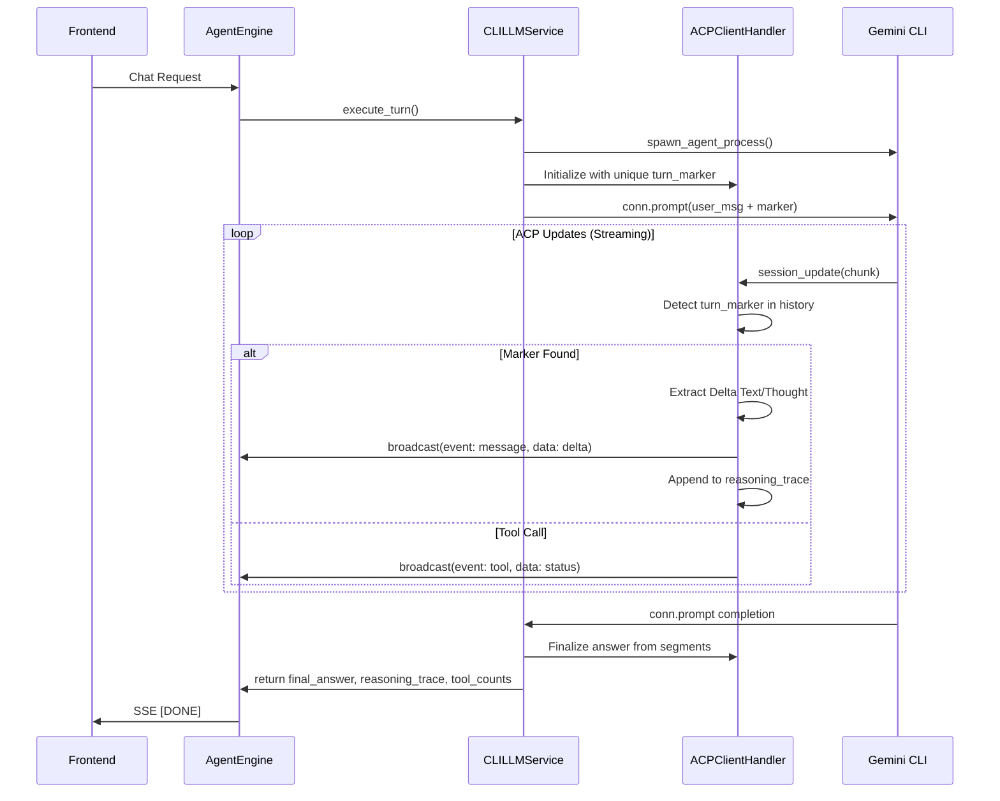

# CLI Engine Streaming Fix

## Issue
The `CLI Engine` (Gemini CLI via ACP) was failing to produce output in the UI. 
Symptoms included:
1. No output initially.
2. After a partial fix, tool calls were visible but reasoning/thoughts and the final result message were missing.

## Root Causes
1. **Context Manager Termination**: The `CLILLMService.execute_turn` might have been exiting the `spawn_agent_process` context manager before the agent finished its turn, killing the process and cutting off the stream.
2. **Marker Sync Issues**: The `turn_marker` used to synchronize re-emitted history might have been missed or mangled.
3. **Data Extraction**: `AgentThoughtChunk` and `AgentMessageChunk` might have content structures (e.g., lists or different fields) that the initial `_extract_text` helper didn't handle.
4. **Logic Parity**: The accumulation of `reasoning_trace` and `final_answer` was not fully aligned with `SDKLLMService`, leading to missing data in the final return.

## Proposed Fixes
1. **Comprehensive Logging**: Added detailed debug logging to `ACPClientHandler` to trace every chunk received and the state of synchronization.
2. **Robust Text Extraction**: Updated `_extract_text` to handle lists of content blocks and additional fields like `thought`.
3. **Synchronization Improvement**: Changed the `turn_marker` format and added logging to verify its detection.
4. **Result Alignment**: Refactored `execute_turn` and `ACPClientHandler` to collect all text segments into the `reasoning_trace` and correctly identify the final answer, ensuring parity with the SDK engine.
5. **Turn Completion**: Ensured `execute_turn` waits for the agent process to complete its response cycle.

## Architecture Decision Record (ADR)
* **Status**: Accepted
* **Context**: We need the CLI Engine to be as reliable and feature-complete as the SDK Engine.
* **Decision**: Implement a robust synchronization mechanism using a unique turn marker and a stateful handler that filters history and captures all output types (text, thoughts, tools).
* **Consequences**: Improved reliability, better debugging, and a consistent user experience across different LLM engines.

## Mermaid Diagram

