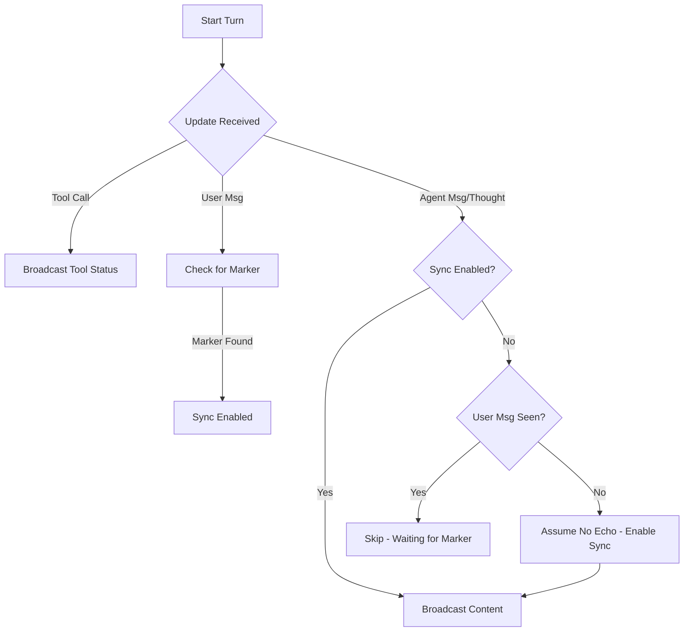

# ADR: CLI Engine Synchronization Fallback

## Status
Proposed

## Context
The `CLILLMService` uses a unique `turn_marker` appended to the user prompt to identify where the new agent response begins in the ACP stream. This is necessary because some ACP-compatible CLI versions re-emit the entire conversation history.

However, if the CLI version or configuration does not re-emit the prompt (history echo disabled), the `ACPClientHandler` never finds the marker. Consequently, it suppresses all `AgentMessageChunk` and `AgentThoughtChunk` events, leading to a UI where only tool calls are visible, and final answers are missing.

## Decision
We will implement a "Smart Synchronization" fallback in `ACPClientHandler`:
1. **Marker-First**: Continue to search for the `turn_marker` in all chunks.
2. **History Echo Detection**: Track if any `UserMessageChunk` has been received.
3. **Fallback**: If an `AgentMessageChunk` or `AgentThoughtChunk` is received *before* any `UserMessageChunk`, assume history echo is disabled and immediately enable output synchronization.
4. **Logging**: Add explicit debug logging for marker detection and synchronization state changes.

## Consequences
- **Robustness**: The CLI engine will work correctly across different CLI versions and configurations (both history-echoing and non-echoing).
- **Correctness**: Preserves the ability to filter history when it is indeed re-emitted.

## Mermaid Diagram

