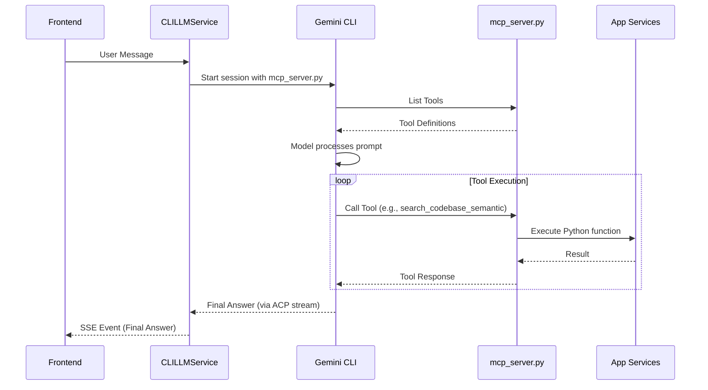

# MCP Tool Integration for CLI Engine

This document describes how the application tools are exposed to the Gemini CLI engine using the Model Context Protocol (MCP).

## Architecture

When the `LLM_ENGINE` is set to `cli`, the `CLILLMService` uses the Gemini CLI to interact with the model. Unlike the SDK engine, which orchestrates the tool loop in the backend, the Gemini CLI orchestrates its own tool loop using MCP.

To enable this, we provide an MCP server (`mcp_server.py`) that exposes our Python-based tools.

### Components

1.  **`mcp_server.py`**: A standalone script that uses the `FastMCP` library to expose application tools as MCP tools.
2.  **`CLILLMService`**: Updated to register the `mcp_server.py` as an MCP server when initializing a session with the Gemini CLI via ACP.

### Tool List

The following tools are exposed via the MCP server:

*   `list_files`: Lists files in the codebase, respecting `.gitignore`.
*   `read_file`: Reads file content with line-based truncation.
*   `get_file_history`: Retrieves git history for a file.
*   `get_recent_commits`: Retrieves recent repository commits.
*   `grep_code`: Searches the codebase for patterns.
*   `get_file_outline`: Provides a high-level outline of a code file.
*   `read_android_manifest`: Extracts details from Android manifest files.
*   `get_definition`: Finds symbol definitions using LSP.
*   `search_codebase_semantic`: Performs RAG-based semantic search.
*   `fetch_url`: Fetches and parses web content.
*   `write_to_docs`: Writes documentation to the `docs/` folder.

## Sequence Diagram

## Implementation Details

### MCP Server Environment
The `mcp_server.py` requires several environment variables to function correctly:
*   `GOOGLE_API_KEY`: For semantic search (embeddings).
*   `CODEBASE_ROOT`: To locate the project files.
*   `PYTHONPATH`: Set to the project root to allow importing the `app` package.

### LSP Integration
Tools that rely on LSP (`get_definition`, `get_file_outline`) will lazily initialize the `LSPManager` within the MCP server process if they are called.
